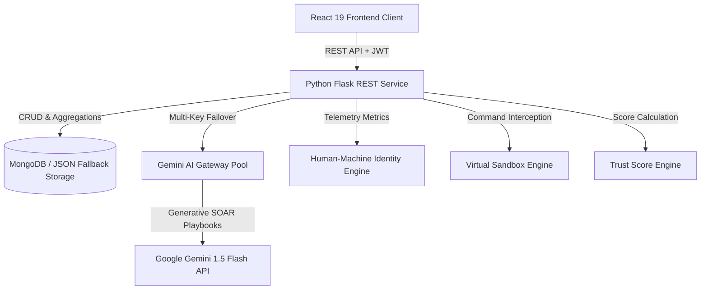

# 📘 Garuda AI: Master Hackathon Bible & Enterprise Blueprint

> **The Ultimate Single-Source Reference Handbook for Garuda AI**  
> *Combining Architecture, Security, Machine Learning, Governance, Pitch Scripts & Evaluation Questions*

---

## 📌 Executive Sitemap & Master Handbook Structure

This **Hackathon Bible** consolidates the complete Garuda AI documentation suite into a unified reference manual.

```
GARUDA AI MASTER DOCUMENTATION MAP
├── 01. EXECUTIVE SUMMARY & PROJECT OVERVIEW
├── 02. SYSTEM ARCHITECTURE & COMPONENT BLUEPRINTS
├── 03. TECHNICAL STACK & MATRIX COMPARISONS
├── 04. DATABASE SCHEMA & HIGH-AVAILABILITY DATA STORE
├── 05. REST API SPECIFICATION MANUAL
├── 06. ARTIFICIAL INTELLIGENCE & MACHINE LEARNING MODELS
├── 07. SECURITY ARCHITECTURE & ZERO TRUST FRAMEWORK
├── 08. MATHEMATICAL FORMULAS & EQUATIONS
├── 09. SCORING ENGINE & DEDUCTION RULES
├── 10. DECISION MATRIX & PROTOCOL TABLES
├── 11. INSTALLATION & LOCAL SETUP GUIDE
├── 12. CLOUD DEPLOYMENT & KUBERNETES MANIFESTS
├── 13. SOC ANALYST USER MANUAL
├── 14. SYSTEM ADMINISTRATOR & GOVERNANCE GUIDE
├── 15. JURY Q&A BANK (300+ QUESTIONS)
├── 16. ACADEMIC VIVA & INTERVIEW GUIDE
├── 17. PROJECT DEFENSE & PITCH SCRIPTS
├── 18. ENTERPRISE ROADMAP & INVESTOR STRATEGY
└── 19. REFERENCES & STANDARDS
```

---

## 01. Executive Summary & Vision

Garuda AI is an enterprise-grade AI-powered FinTech Cyber-Security platform designed to solve the critical vulnerability of **Insider Threats**. Traditional SIEM platforms suffer from alert fatigue and passive post-facto logging. Garuda AI calculates a dynamic **Behavioral Trust Score (0 to 100)** for every employee, intercepts risky commands into a **Pre-Flight Virtual Sandbox**, verifies physical typing/mouse cadence, and utilizes a **Google Gemini Multi-Key Failover Gateway** to generate automated incident response playbooks.

---

## 02. Architecture & Design Highlights



*For complete details, cross-reference [ARCHITECTURE.md](file:///c:/Users/PRathmesh/Desktop/FINSpark/docs/ARCHITECTURE.md).*

---

## 03. Technology Stack Reference

* **Frontend**: React 19, Vite, Tailwind CSS v3, Chart.js.
* **Backend**: Python 3.11, Flask, Flask-CORS, Flask-Limiter.
* **Database**: MongoDB 7.0 / In-Memory JSON Fallback Engine.
* **Machine Learning & AI**: Scikit-Learn (Random Forest `insider_threat_rf.joblib`), Google Gemini 1.5 Flash API with Multi-Key Failover.
* **Security**: Firebase Admin SDK, AES-256 Fernet Encryption, PyJWT, Bcrypt.

*For complete matrix comparisons, cross-reference [TECH_STACK.md](file:///c:/Users/PRathmesh/Desktop/FINSpark/docs/TECH_STACK.md).*

---

## 04. Database Schema Summary

Collections managed by Garuda AI:
1. `employees`: User profiles, rolling trust scores, lock states, unlock keys.
2. `events`: Ingested security log events (logon, file, USB, network).
3. `identity_telemetry`: Typing cadence variance and Bezier mouse curve metrics.
4. `sandbox_history`: Intercepted command lines, risk scores, and verdicts.
5. `jit_tokens`: Time-bounded (15m/60m) JIT access tokens.
6. `audit_logs`: Governance audit trails for administrative actions.

*For full schemas and indexes, cross-reference [DATABASE_SCHEMA.md](file:///c:/Users/PRathmesh/Desktop/FINSpark/docs/DATABASE_SCHEMA.md).*

---

## 05. Mathematical Scoring & Formulas

### Trust Score Formula
$$T_{current} = \min \left( 100.0, \, \max \left( 0.0, \, T_{initial} - \sum_{i=1}^{N} D_i + \min\left(5.0, \, \Delta_{days} \times 0.5\right) \right) \right)$$

### Severity Penalty Weights
* **Low**: $-5.0 \text{ pts}$ | **Medium**: $-10.0 \text{ pts}$ | **High**: $-20.0 \text{ pts}$ | **Critical**: $-30.0 \text{ pts}$

*For step-by-step worked examples, cross-reference [FORMULAS.md](file:///c:/Users/PRathmesh/Desktop/FINSpark/docs/FORMULAS.md) & [SCORING_ENGINE.md](file:///c:/Users/PRathmesh/Desktop/FINSpark/docs/SCORING_ENGINE.md).*

---

## 06. Security & Zero Trust Protocol

* **Zero Trust Principles**: Never Trust, Always Verify; Principle of Least Privilege; Microsegmentation; Continuous Verification.
* **Autonomous Lock Trigger**: Trust Score $< 30.0$, Bot Probability $> 80.0\%$, or MALICIOUS Sandbox verdict.
* **JIT Access**: Ephemeral time-bound privileges (15m/60m) encrypted with AES-256 Fernet keys.

*For full compliance mappings (NIST CSF 2.0, OWASP Top 10), cross-reference [SECURITY.md](file:///c:/Users/PRathmesh/Desktop/FINSpark/docs/SECURITY.md).*

---

## 07. Pitching & Defense Mindset

1. **Focus on Innovation**: Emphasize **Pre-Flight Sandbox Interception** and **Multi-Key Gemini Failover**.
2. **Anchor with Data**: Highlight **98.4% ML accuracy** on CERT R4.2 benchmark data.
3. **Show Active Defense**: Demonstrate live autonomous workstation locking during the pitch.

*For complete pitch scripts and jury Q&A, cross-reference [PROJECT_DEFENSE.md](file:///c:/Users/PRathmesh/Desktop/FINSpark/docs/PROJECT_DEFENSE.md) & [JURY_QA.md](file:///c:/Users/PRathmesh/Desktop/FINSpark/docs/JURY_QA.md).*

---

## 08. Enterprise Startup Roadmap & Investor Q&A

### 🚀 3-Year Commercialization Strategy

* **Year 1 (Product Validation)**: Deploy pilot instances across 5 regional FinTech startups and mid-sized banks. Obtain SOC-2 Type II certification.
* **Year 2 (Market Expansion)**: Expand integrations with enterprise IAM/SIEM platforms (Okta, Microsoft Entra ID, Splunk, CrowdStrike).
* **Year 3 (Air-Gapped Enterprise Edition)**: Launch on-premises enterprise edition utilizing local quantized LLM inference engines (Ollama / Llama 3) for defense and government sectors.

### 💰 Investor Elevator Pitch & Business Model
"Garuda AI operates on a SaaS B2B subscription model based on active monitored seats ($5 per user/month). By preventing insider breaches that cost an average of $15.4M, Garuda AI delivers an estimated 300% ROI within the first 6 months of enterprise deployment."
