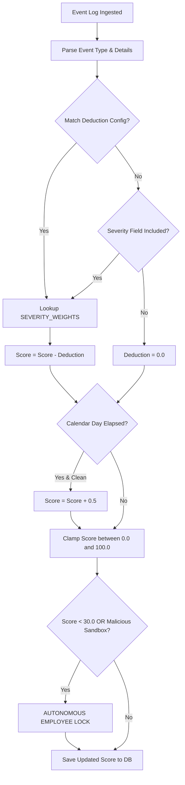

# 🧮 Garuda AI: Scoring Engine Architecture & Rule Engine Specification

> **Complete Operational Guide to Behavioral Scoring, Penalties & Containment Rules**  
> *Cross-Reference: [FORMULAS.md](file:///c:/Users/PRathmesh/Desktop/FINSpark/docs/FORMULAS.md) | [DECISION_MATRIX.md](file:///c:/Users/PRathmesh/Desktop/FINSpark/docs/DECISION_MATRIX.md) | [AI_MODELS.md](file:///c:/Users/PRathmesh/Desktop/FINSpark/docs/AI_MODELS.md)*

---

## 📌 1. Scoring Engine Overview

The Garuda AI Scoring Engine (`backend/trust_score.py`) continuously transforms multi-source security event logs into an accurate, rolling **Behavioral Trust Score (0.0 to 100.0)**. 

The scoring engine operates deterministically. Every security infraction deducts points according to a configurable severity matrix (`SEVERITY_WEIGHTS`), while periods of clean behavior allow gradual score recovery (`RECOVERY_RATE_PER_DAY`).

```
+-----------------------------------------------------------------------------------+
|                           GARUDA AI SCORING ENGINE PIPELINE                       |
+-----------------------------------------------------------------------------------+
|  [ Event Log Ingestion ]                                                          |
|            |                                                                      |
|            v                                                                      |
|  [ Event Categorization & Severity Lookup ] (Low: -5, Med: -10, High: -20, Crit: -30)|
|            |                                                                      |
|            v                                                                      |
|  [ Chronological Score Deductions ]                                               |
|            |                                                                      |
|            v                                                                      |
|  [ Daily Clean Recovery Calculation ] (+0.5 points / clean day)                   |
|            |                                                                      |
|            v                                                                      |
|  [ Clamping & Safeguard Layer ] (0.0 <= Trust Score <= 100.0)                      |
|            |                                                                      |
|            v                                                                      |
|  [ Autonomous Action Trigger ] (If Score < 30.0 -> LOCK EMPLOYEE WORKSTATION)     |
+-----------------------------------------------------------------------------------+
```

---

## 2. Comprehensive Scoring Reference Tables

---

### 📊 Table 2.1: Base Severity Weight Dictionary (`SEVERITY_WEIGHTS`)

| Severity Classification | Score Deduction ($D_i$) | Description & Severity Context |
|---|---|---|
| **Low** | **-5.0 Points** | Minor policy deviations (e.g., after-hours logon). |
| **Medium** | **-10.0 Points** | Suspicious activities (e.g., USB connection, restricted file access, external attachment). |
| **High** | **-20.0 Points** | Major security infractions (e.g., unauthorized privilege escalation, mass transfer $> 1\text{ GB}$). |
| **Critical** | **-30.0 Points** | Severe threat indicators (e.g., identity script automation detected, malicious sandbox verdict). |

---

### 📊 Table 2.2: Event Category & Deduction Config (`DEDUCTION_CONFIG`)

| Event Category | Trigger Condition | Severity Level | Deduction Applied |
|---|---|---|---|
| `after_hours_login` | Logon timestamp between 10:00 PM and 05:00 AM | Low | **-5.0 Points** |
| `unknown_device_login` | Logon from non-registered MAC/IP or unknown region | Medium | **-10.0 Points** |
| `usb_connect` | Insertion of unsanctioned removable USB storage | Medium | **-10.0 Points** |
| `confidential_file_access` | Accessing document tagged `Confidential` | Medium | **-10.0 Points** |
| `restricted_file_access` | Accessing document tagged `Restricted` | Medium | **-10.0 Points** |
| `large_file_transfer` | Data egress between $100\text{ MB}$ and $1000\text{ MB}$ | Medium | **-10.0 Points** |
| `massive_data_transfer` | Data egress exceeding $1000\text{ MB}$ ($1.0\text{ GB}$) | High | **-20.0 Points** |
| `unauthorized_privilege_escalation` | Modifying local admin group without approved JIT token | High | **-20.0 Points** |
| `identity_automation_detected` | Bot telemetry confidence $> 80.0\%$ | Critical | **-30.0 Points** |
| `sandbox_malicious` | Intercepted command receives MALICIOUS verdict | Critical | **-30.0 Points** |

---

### 📊 Table 2.3: Trust Score Classification Ranges

| Trust Score Range | Status Tag | System Action Required |
|---|---|---|
| **80.0 to 100.0** | **Healthy** | Normal operation. Standard logging. |
| **60.0 to 79.9** | **Low Risk** | Routine monitoring. No analyst intervention required. |
| **40.0 to 59.9** | **Medium Risk** | Heightened audit. Intercept high-risk commands into Sandbox. |
| **30.0 to 39.9** | **High Risk** | Generate Tier-1 SOC Alert. Generate Gemini SOAR Playbook. |
| **0.0 to 29.9** | **CRITICAL** | **AUTONOMOUS WORKSTATION LOCK**. Revoke JIT Access Tokens. |

---

## 3. Scoring Rules & Operational Logic

---

### 3.1 Clean Behavior Recovery Rules

To ensure employees are not permanently penalized for minor mistakes, Garuda AI implements a clean recovery rate:
* **Recovery Rate**: $+0.5 \text{ points}$ per full calendar day of zero security infractions.
* **Cap Limit**: Recovery cannot elevate a score beyond $100.0$.
* **Interruption**: Any new security infraction immediately halts recovery and applies deductions.

```python
# Python Recovery Logic Implementation (from trust_score.py)
RECOVERY_RATE_PER_DAY = 0.5

if event_date > last_date:
    days_diff = (event_date - last_date).days
    if days_diff > 1 and score < 100.0:
        clean_days = min(5, days_diff - 1)
        score = min(100.0, score + (clean_days * RECOVERY_RATE_PER_DAY))
```

---

### 3.2 Autonomous Workstation Lock Rules

The platform automatically locks an employee's profile and workstation when **ANY** of the following conditions are met:
1. **Rule 1**: Cumulative Trust Score drops below **30.0**.
2. **Rule 2**: `identity_monitoring` detects Bot Probability $> 80.0\%$.
3. **Rule 3**: `sandbox` verification returns a **MALICIOUS** verdict on an intercepted command line.

When locked:
* `is_locked` is set to `true`.
* A unique, cryptographically secure 16-character unlock key is generated (`GARUDA-UNLOCK-XXXX-XXXX`).
* All active JIT access tokens for the employee are immediately revoked.

---

## 4. Scoring Logic Flowchart



---

## 5. Scoring Engine Pseudocode

```python
function recalculate_employee_trust_score(employee_id, db):
    events = db.events.find({"employee_id": employee_id}).sort("timestamp", ASCENDING)
    
    score = 100.0
    last_date = NULL
    
    for event in events:
        current_date = extract_date(event.timestamp)
        
        # 1. Apply Clean Days Recovery
        if last_date IS NOT NULL and current_date > last_date:
            clean_days = (current_date - last_date).days - 1
            if clean_days > 0 and score < 100.0:
                score = min(100.0, score + (clean_days * 0.5))
                
        # 2. Evaluate Event Penalty Deductions
        deductions = evaluate_event_deduction(event)
        for (deduction_name, points) in deductions:
            score = max(0.0, score - points)
            
        last_date = current_date
        
    # 3. Final Clamping
    final_score = round(max(0.0, min(100.0, score)), 2)
    
    # 4. Lock Trigger Safeguard
    if final_score < 30.0:
        trigger_employee_lock(employee_id, reason="Trust score dropped below 30.0 threshold")
        
    return final_score
```
