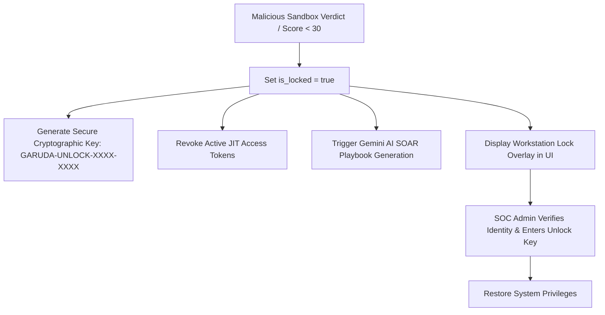

# 🔒 Garuda AI: Comprehensive Security Architecture & Zero Trust Specification

> **Enterprise Security Manual, Compliance Mappings & Zero Trust Architecture**  
> *Cross-Reference: [ARCHITECTURE.md](file:///c:/Users/PRathmesh/Desktop/FINSpark/docs/ARCHITECTURE.md) | [API_DOCUMENTATION.md](file:///c:/Users/PRathmesh/Desktop/FINSpark/docs/API_DOCUMENTATION.md) | [FORMULAS.md](file:///c:/Users/PRathmesh/Desktop/FINSpark/docs/FORMULAS.md)*

---

## 📌 1. Zero Trust Architecture (ZTA) Principles

Garuda AI adheres strictly to the **NIST SP 800-207 Zero Trust Architecture Framework**:

1. **Never Trust, Always Verify**: No user, workstation, or IP address inside the corporate perimeter is inherently trusted. Every API invocation evaluates user credentials, active JIT tokens, and current Trust Scores.
2. **Principle of Least Privilege (PoLP)**: Employees operate with minimal static baseline permissions. Administrative elevations are restricted to time-bounded JIT access tokens (15m/60m).
3. **Microsegmentation & Pre-Flight Interception**: Risky command lines are isolated into virtual sandbox environments prior to endpoint host execution.
4. **Continuous Behavioral Assessment**: Identity is re-verified continuously based on physical cadence metrics (typing dynamics, mouse Bezier curves).

```
+-----------------------------------------------------------------------------------+
|                            GARUDA AI ZERO TRUST PIPELINE                          |
+-----------------------------------------------------------------------------------+
|  [ User Action ] --> [ JWT Auth ] --> [ RBAC Permission ] --> [ Trust Score Check]|
|                                                                        |          |
|                                                                        v          |
|  [ Execution Allowed ] <-- [ Virtual Sandbox ] <-- [ Identity Check ] <-----------+
+-----------------------------------------------------------------------------------+
```

---

## 2. Authentication & Authorization Framework

---

### 2.1 JSON Web Tokens (JWT) Architecture

* **Algorithm**: HMAC-SHA256 (`HS256`).
* **Secret Key Management**: Key loaded from `JWT_SECRET_KEY` environment variable.
* **Token Payload Claims**:
```json
{
  "sub": "user_id_10293",
  "email": "analyst@garuda.ai",
  "role": "SOC_Analyst",
  "iat": 1777082400,
  "exp": 1777118400
}
```

---

### 2.2 Role-Based Access Control (RBAC) Matrix

Garuda AI enforces strict route-level permission decorators (`@require_permission`, `@require_role` in `backend/security/rbac_middleware.py`):

| Role | View Dashboard | Recalculate Scores | Evaluate Sandbox | Issue JIT Tokens | Lock/Unlock Employees | System Admin |
|---|---|---|---|---|---|---|
| **Employee** | ❌ | ❌ | ❌ | ❌ | ❌ | ❌ |
| **Auditor** | ✅ | ❌ | ❌ | ❌ | ❌ | ❌ |
| **SOC Analyst Tier 1** | ✅ | ✅ | ✅ | ❌ | ❌ | ❌ |
| **SOC Lead / Admin** | ✅ | ✅ | ✅ | ✅ | ✅ | ✅ |

---

## 3. Cryptographic Data Security

* **Data in Transit**: Enforced TLS 1.3 / HTTPS encryption across all client-server communication channels.
* **Data at Rest**: Sensitive database strings, password hashes, and JIT cryptographic keys are encrypted using **Fernet (AES-256 in CBC mode with PKCS7 padding and HMAC-SHA256 authentication)** via Python `cryptography` library.
* **Password Hashing**: Passwords stored using **Bcrypt** with a work factor of 12 rounds ($2^{12}$ iterations).

---

## 4. Compliance & Security Framework Mappings

---

### 🛡️ 4.1 OWASP Top 10 (2021) Mitigation Matrix

| OWASP Vulnerability | Risk Description | Garuda AI Protection Strategy |
|---|---|---|
| **A01: Broken Access Control** | Unauthorized privilege escalation | Enforces JWT validation and `@require_permission` decorators on all endpoints. |
| **A02: Cryptographic Failures**| Data exposure in transit or rest | Uses AES-256 Fernet encryption and Bcrypt password hashing. |
| **A03: Injection** | SQL/NoSQL & Command Injection | PyMongo parameterized queries; Sandbox command parsing removes shell metacompound characters. |
| **A04: Insecure Design** | Lack of security controls | Native Zero Trust architecture with real-time Trust Score gating. |
| **A05: Security Misconfiguration** | Default credentials or API keys exposed | Key masking (`AIza************7Hx`) in all logs and frontend views. |
| **A07: Identification & Auth Failures** | Brute force or session hijacking | Flask-Limiter limits requests (100 req/min); Firebase Auth integration. |

---

### 🏛️ 4.2 NIST Cybersecurity Framework (CSF 2.0) Mapping

| NIST Core Function | Garuda AI System Implementation |
|---|---|
| **GOVERN (GV)** | RBAC policies, audit log collections, compliance reporting. |
| **IDENTIFY (ID)** | Continuous Human-Machine identity cadence classification and asset discovery. |
| **PROTECT (PR)** | Just-In-Time access management, API key rotation, virtual sandboxing. |
| **DETECT (DE)** | Behavioral Trust Score Engine, Scikit-Learn Random Forest anomaly detection. |
| **RESPOND (RS)** | Google Gemini automated SOAR playbooks and instant workstation lock. |
| **RECOVER (RC)** | Daily clean-behavior score recovery algorithms (+0.5 pts/day). |

---

## 5. Security Incident Response & Workstation Containment Workflow

When an employee's Trust Score falls below **30.0** or a **MALICIOUS** sandbox verdict is detected:


