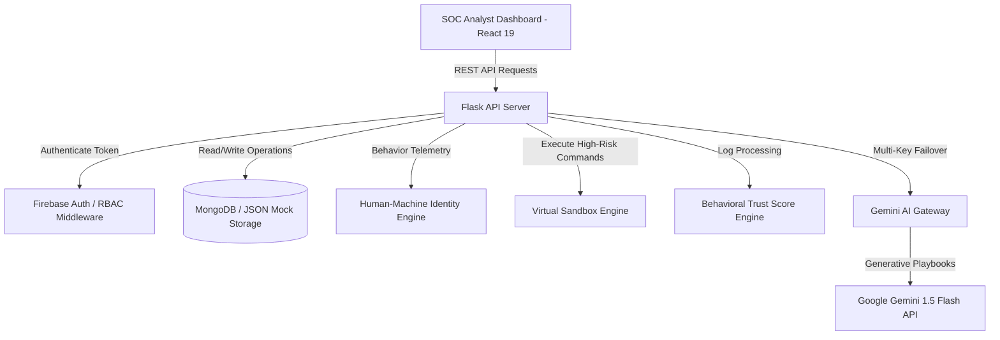
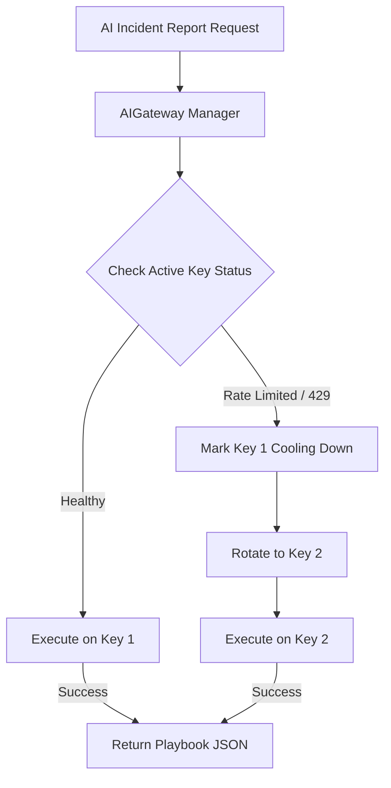
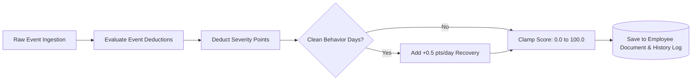
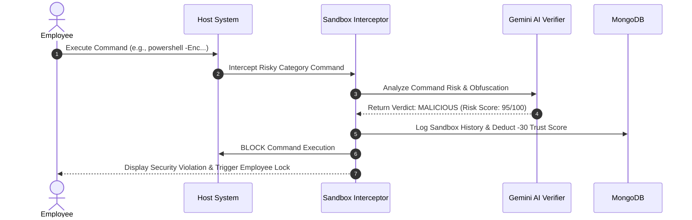
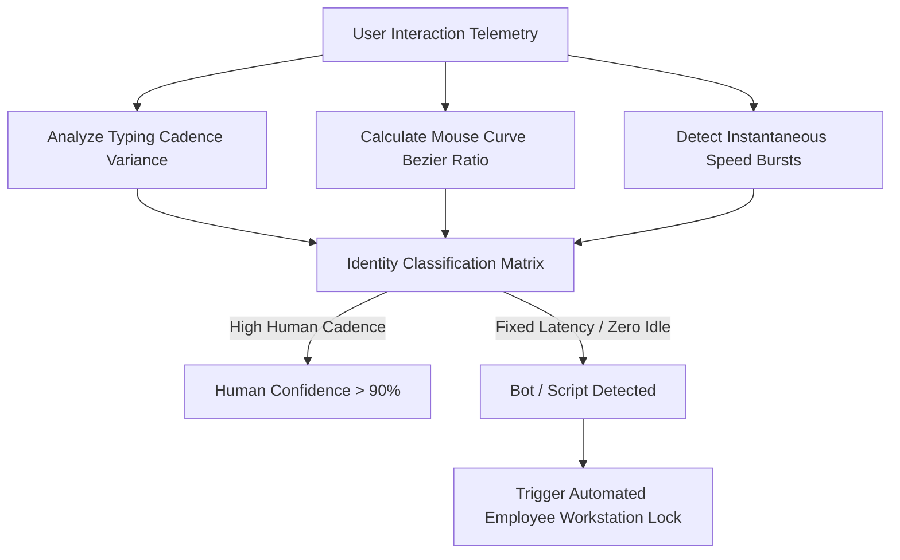
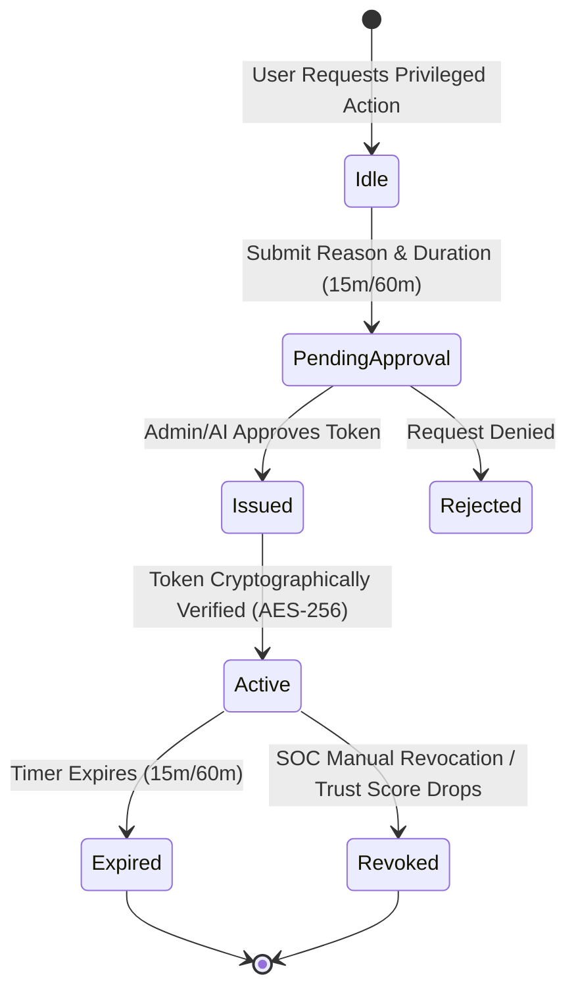
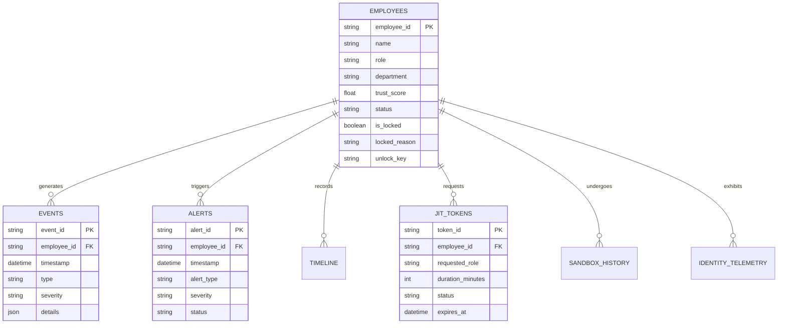

# 🏗️ Garuda AI: System Architecture & Engineering Blueprint

> **Comprehensive Architectural Reference Manual**  
> *Cross-Reference: [TECH_STACK.md](file:///c:/Users/PRathmesh/Desktop/FINSpark/docs/TECH_STACK.md) | [DATABASE_SCHEMA.md](file:///c:/Users/PRathmesh/Desktop/FINSpark/docs/DATABASE_SCHEMA.md) | [AI_MODELS.md](file:///c:/Users/PRathmesh/Desktop/FINSpark/docs/AI_MODELS.md)*

---

## 📌 1. Executive Architectural Overview

Garuda AI is designed as an autonomous, multi-layered threat intelligence and zero-trust control system. It processes streaming behavioral telemetry (logon, file access, email, USB device events, process execution, and human/bot physical interaction metrics) through a pipeline of mathematical scoring algorithms, machine learning models, and generative AI services.

```
+-----------------------------------------------------------------------------------+
|                            GARUDA AI ARCHITECTURAL STACK                          |
+-----------------------------------------------------------------------------------+
|  [ LAYER 1: INGESTION ]  --> Webhooks, Synthetic Stream, CERT R4.2 Pipeline      |
|  [ LAYER 2: TELEMETRY ]  --> Human/Machine Cadence, Command Interceptor          |
|  [ LAYER 3: SCORING ]    --> Behavioral Trust Engine, Random Forest ML            |
|  [ LAYER 4: VERIFICATION]--> Virtual AI Sandbox Execution Engine                    |
|  [ LAYER 5: GOVERNANCE ] --> Just-In-Time (JIT) PAM, Automated Employee Lock      |
|  [ LAYER 6: SYNTHESIS ]  --> Gemini Multi-Key Failover Gateway (SOAR Playbooks)   |
|  [ LAYER 7: PRESENTATION]--> React 19 SOC Security Dashboard                      |
+-----------------------------------------------------------------------------------+
```

---

## 2. Core Architectural Sub-Systems

---

### 2.1 High-Level Architecture

The platform separates presentation (React SPA) from core intelligence services (Flask REST API). All communications take place over encrypted JSON REST endpoints protected by JWT authentication and RBAC permissions.



#### Diagram Explanation
1. **SOC Analyst Dashboard**: Communicates with the Flask REST server over HTTP/HTTPS.
2. **Flask API Server**: Acts as the central orchestrator routing requests to specialized processing engines.
3. **Identity & Sandbox Engines**: Synchronously evaluate behavioral anomalies before commands execute.
4. **Trust Score Engine**: Recalculates user scores on every event ingestion.
5. **Gemini AI Gateway**: Manages an API key pool to guarantee high availability for automated incident response.

---

### 2.2 Frontend Architecture (React 19 + Vite)

The frontend architecture follows a modular visual component pattern. The main application container (`frontend/src/App.jsx`) manages state synchronization across sub-dashboards.

* **Components**:
  * `JitPamDashboard.jsx`: Privileged access token generation and approval workflows.
  * `SandboxDashboard.jsx`: Interactive command testing and virtual sandbox execution logs.
  * `HumanIdentityDashboard.jsx`: Real-time visualization of typing flight times, Bezier mouse curves, and bot probability indicators.
  * `AuditLogsView.jsx`: System-wide audit log table with natural language search filters.
  * `RbacUserManagementModal.jsx`: Administrative role assignment and user lock management.

---

### 2.3 Backend Architecture (Python 3.11 + Flask)

The backend follows a modular service pattern with Blueprint routing:

* `app.py`: Application entry point, CORS initialization, rate limiting rules, and blueprint bindings.
* `trust_score.py`: Pure mathematical implementation of trust decay and clean-day recovery algorithms.
* `identity_monitoring.py`: Telemetry classifier calculating human vs. machine confidence percentages.
* `sandbox.py`: Isolated command simulation engine evaluating command strings against security signatures.
* `ai_gateway.py`: Thread-safe multi-key API manager handling failovers and rate limit cooling down periods.
* `routes/`: Modular endpoints (`jit_routes.py`, `sandbox_routes.py`, `rbac_routes.py`).

---

### 2.4 Database Architecture (MongoDB + JSON HA Storage Engine)

Garuda AI utilizes a dual-mode database engine:
1. **Primary Mode (MongoDB)**: High-performance NoSQL document database indexing user events, trust histories, and audit logs.
2. **High-Availability Fallback Mode (`db_client.py`)**: An in-memory, thread-safe JSON document store that takes over if MongoDB connection drops, guaranteeing zero system downtime during critical operations.

---

### 2.5 AI Architecture & Gemini Multi-Key Failover Gateway

Generative AI calls are handled through an resilient proxy layer (`backend/ai_gateway.py`). The gateway maintains a dynamic pool of API keys configured via environment variables (`GEMINI_API_KEY_1`, `GEMINI_API_KEY_2`, etc.).



#### Key Management Strategies
* **Round Robin**: Distributes requests sequentially across all healthy keys.
* **Least Recently Used (LRU)**: Selects the key with the longest idle period.
* **Automatic Cooldown**: Temporarily isolates keys encountering HTTP 429 rate limit errors for 60 seconds before auto-restoration.

---

### 2.6 Behavioral Trust Score Engine Pipeline

The Trust Score Engine recalculates employee trust scores using a chronological event evaluator (`recalculate_score` in `backend/trust_score.py`).



---

### 2.7 Virtual Sandbox Interception Architecture

High-risk actions (e.g., PowerShell bypass commands, mass file deletions, registry edits) are routed through the virtual sandbox engine (`backend/sandbox.py`) prior to host execution.



---

### 2.8 Human-Machine Identity Monitoring System

This module inspects physical user telemetry:
* **Typing Cadence**: Flight time variance, key hold duration, WPM stability.
* **Mouse Movement**: Bezier curves (Human) vs. Linear point-to-point (Bot).
* **API Latency**: Microsecond integer delays indicating script automation.



---

### 2.9 Just-In-Time (JIT) Access Architecture

To prevent permanent administrative privilege abuse, Garuda AI implements time-bounded JIT access tokens (`backend/routes/jit_routes.py`).



---

## 3. Comprehensive Entity-Relationship Diagram (ERD)



---

## 4. Architectural Security Matrix & Boundaries

| Boundary Layer | Controls Implemented | Disaster Recovery Plan |
|---|---|---|
| **Client UI** | React Input Sanitization, LocalStorage JWT isolation | Page Auto-refresh with clear state |
| **API Ingestion** | Flask-Limiter (100 req/min), CORS Whitelisting | HTTP 429 Rate Limit Response |
| **Data Persistence**| PyMongo Indexed Queries, Thread-Safe JSON Fallback Engine | Seamless JSON Mock Database Auto-Switch |
| **AI Subsystem** | Multi-Key LRU Pool Manager, Exponential Backoff | Static Local Playbook Engine Fallback |
